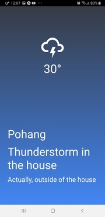

# Weather App

## Project

- 프로젝트 : Scheduler App
- 개요 : Learning React Native by Building a Weather App with Expo
- 언어 : Expo, React Native, JavaScript
- 기간 : 21.08.20 ~ 08.25

### 주요 기능

- App을 실행시키면 그 휴대폰의 위치 정보를 요청합니다.
- 그 위치의 지역명과 날씨에 대한 실시간 정보를 화면을 통해 전달해줍니다.

### 사용 방법

1. 모바일 폰에 Expo Go 앱을 다운받습니다.
2. 앱을 실행시킨 후 qr코드 스캔을 클릭합니다.
3. 아래 링크에 있는 qr코드를 스캔합니다.

### Weather App [Link](https://expo.dev/@wonnjin/React-Native-WeatherApp)

---

### Activity Screen

|          Loading          |
| :-----------------------: |
|  |

|                                               Weather                                               |
| :-------------------------------------------------------------------------------------------------: |
|     |
